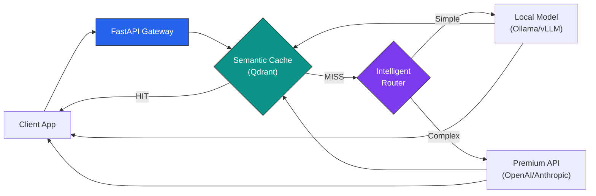

# High-Performance LLM Gateway — Project Blueprint & Build Guide (v1)

## What You're Building

An enterprise-ready middleware gateway that sits between your applications and LLM APIs. It does three things:

1. **Semantic Cache** — Embeds queries into vectors, finds near-duplicates, serves cached answers in <10ms
2. **Intelligent Router** — Classifies query complexity, routes cheap queries to local models and hard queries to premium APIs
3. **Resiliency Layer** — Rate limiting, circuit breakers, retries, and streaming — so nothing breaks under load



---

## Tech Stack

| Layer | Technology | Why |
|---|---|---|
| **API Framework** | FastAPI | Async-native, OpenAPI docs, best Python perf |
| **Vector DB** | Qdrant (Docker) | Purpose-built for vector search, gRPC support, easy self-host |
| **Embeddings** | `sentence-transformers` (`all-MiniLM-L6-v2`) | Fast, small (80MB), runs locally — no API cost |
| **Local LLM** | Ollama | Dead simple local model serving, one binary |
| **Premium API** | OpenAI / Anthropic SDK | Industry standard |
| **Rate Limiting** | Custom token-bucket | No external deps, full control |
| **Streaming** | SSE (Server-Sent Events) | Native browser/client support |
| **Config** | Pydantic Settings + `.env` | Type-safe, validated config |
| **Testing** | pytest + httpx | Async test support |
| **Containerization** | Docker Compose | One command to spin up everything |

---

## Project Structure

```
llm-gateway/
│
├── .env.example                    # Template for environment variables
├── .gitignore
├── pyproject.toml                  # Project metadata & dependencies (use uv or pip)
├── Dockerfile
├── docker-compose.yml              # Gateway + Qdrant + Ollama
├── README.md
│
├── docs/
│   └── architecture.md             # Architecture decision records
│
├── src/
│   └── gateway/
│       ├── __init__.py
│       ├── main.py                 # FastAPI app factory & lifespan
│       ├── config.py               # Pydantic Settings (all env vars)
│       │
│       ├── models/
│       │   ├── __init__.py
│       │   ├── schemas.py          # Request/Response Pydantic models
│       │   └── enums.py            # ModelTier, CacheStatus enums
│       │
│       ├── cache/
│       │   ├── __init__.py
│       │   ├── embedder.py         # SentenceTransformer wrapper
│       │   ├── vector_store.py     # Qdrant client abstraction
│       │   └── semantic_cache.py   # Cache lookup & store orchestration
│       │
│       ├── router/
│       │   ├── __init__.py
│       │   ├── classifier.py       # Query complexity classifier
│       │   └── model_router.py     # Route query → provider
│       │
│       ├── providers/
│       │   ├── __init__.py
│       │   ├── base.py             # Abstract base provider (Protocol)
│       │   ├── openai_provider.py  # OpenAI API integration
│       │   ├── anthropic_provider.py
│       │   └── ollama_provider.py  # Local Ollama integration
│       │
│       ├── resilience/
│       │   ├── __init__.py
│       │   ├── rate_limiter.py     # Token-bucket algorithm
│       │   ├── circuit_breaker.py  # Circuit breaker state machine
│       │   └── retry.py           # Exponential backoff with jitter
│       │
│       ├── streaming/
│       │   ├── __init__.py
│       │   └── sse_handler.py      # SSE response streaming
│       │
│       ├── middleware/
│       │   ├── __init__.py
│       │   ├── logging_mw.py       # Structured request logging
│       │   ├── metrics.py          # Latency & cache-hit metrics
│       │   └── auth.py             # API key validation
│       │
│       └── api/
│           ├── __init__.py
│           ├── deps.py             # FastAPI dependency injection
│           └── v1/
│               ├── __init__.py
│               ├── chat.py         # POST /v1/chat/completions
│               ├── cache.py        # Cache admin endpoints
│               └── health.py       # GET /health, GET /ready
│
├── tests/
│   ├── __init__.py
│   ├── conftest.py                 # Shared fixtures (test client, mock DB)
│   ├── unit/
│   │   ├── __init__.py
│   │   ├── test_semantic_cache.py
│   │   ├── test_classifier.py
│   │   ├── test_rate_limiter.py
│   │   └── test_circuit_breaker.py
│   └── integration/
│       ├── __init__.py
│       ├── test_cache_flow.py
│       └── test_routing_flow.py
│
├── scripts/
│   ├── seed_cache.py               # Pre-populate cache with common queries
│   └── benchmark.py                # Latency & throughput benchmarking
│
└── monitoring/
    ├── prometheus.yml
    └── grafana/
        └── dashboard.json
```

---

## Step-by-Step Build Guide

### Phase 0 — Project Bootstrap
**Goal:** Working Python project with tooling configured.

- [ ] Create the `llm-gateway/` directory
- [ ] Initialize `pyproject.toml` with metadata (use `uv init` or write manually)
- [ ] Set up `.gitignore` (Python, `.env`, `__pycache__`, `.venv`)
- [ ] Create `.env.example` with placeholder keys
- [ ] Create `src/gateway/__init__.py` and `src/gateway/config.py`
  - Use `pydantic-settings` to load from `.env`
  - Define: `OPENAI_API_KEY`, `QDRANT_HOST`, `QDRANT_PORT`, `EMBEDDING_MODEL`, `CACHE_SIMILARITY_THRESHOLD` (default 0.95), `RATE_LIMIT_RPM`
- [ ] Create a bare `src/gateway/main.py` with a FastAPI app and a single `GET /health` endpoint
- [ ] Run it: `uvicorn gateway.main:app --reload`
- [ ] `git init` and make your first commit

> [!TIP]
> **Checkpoint:** `curl localhost:8000/health` returns `{"status": "ok"}`. Config loads from `.env`. You have a clean git history.

---

### Phase 1 — Semantic Cache (The Core Differentiator)
**Goal:** Queries get embedded, stored in Qdrant, and cache hits return instant results.

**This is the most impressive part of the project. Build it first.**

#### Step 1.1 — Embedder
- [ ] Create `src/gateway/cache/embedder.py`
- [ ] Load `sentence-transformers/all-MiniLM-L6-v2` (384-dim vectors)
- [ ] Write `embed(text: str) -> list[float]` and `embed_batch(texts: list[str]) -> list[list[float]]`
- [ ] Make embedding model loading lazy (load on first call, not import time)

#### Step 1.2 — Vector Store
- [ ] Spin up Qdrant via Docker: `docker run -p 6333:6333 qdrant/qdrant`
- [ ] Create `src/gateway/cache/vector_store.py`
- [ ] Implement: `create_collection()`, `upsert(id, vector, payload)`, `search(vector, threshold) -> list[Hit]`
- [ ] Use the `qdrant-client` Python SDK with async support

#### Step 1.3 — Semantic Cache Orchestrator
- [ ] Create `src/gateway/cache/semantic_cache.py`
- [ ] Implement `lookup(query: str) -> CacheResult | None`:
  1. Embed the query
  2. Search Qdrant with similarity threshold (0.95)
  3. If hit → return cached response + metadata (latency, original query)
  4. If miss → return `None`
- [ ] Implement `store(query: str, response: str, metadata: dict)`:
  1. Embed the query
  2. Store vector + payload (response, timestamp, model_used, token_count) in Qdrant

#### Step 1.4 — Wire into the API
- [ ] Create `src/gateway/api/v1/chat.py` with `POST /v1/chat/completions`
- [ ] On request: check cache first. If hit, return immediately with `X-Cache: HIT` header
- [ ] If miss, return a placeholder for now (we'll add providers in Phase 2)
- [ ] Add `X-Cache-Latency-Ms` header to every response

> [!TIP]
> **Checkpoint:** Send the same query twice. First = `MISS`, second = `HIT` in <10ms. Log both to stdout. Verify in Qdrant's dashboard at `localhost:6333/dashboard`.

---

### Phase 2 — LLM Providers (The Backends)
**Goal:** Abstract multiple LLM backends behind a common interface.

#### Step 2.1 — Provider Protocol
- [ ] Create `src/gateway/providers/base.py`
- [ ] Define a `Provider` Protocol:
  ```python
  class Provider(Protocol):
      async def generate(self, messages: list[Message], **kwargs) -> LLMResponse: ...
      async def generate_stream(self, messages: list[Message], **kwargs) -> AsyncIterator[str]: ...
  ```

#### Step 2.2 — Ollama Provider (Local)
- [ ] Install Ollama, pull `llama3.1:8b`
- [ ] Create `src/gateway/providers/ollama_provider.py`
- [ ] Use `httpx.AsyncClient` to call Ollama's REST API (`POST /api/chat`)
- [ ] Support both sync and streaming responses

#### Step 2.3 — OpenAI Provider (Premium)
- [ ] Create `src/gateway/providers/openai_provider.py`
- [ ] Use the official `openai` SDK with async client
- [ ] Support streaming via `stream=True`

#### Step 2.4 — Wire into Chat Endpoint
- [ ] Update `POST /v1/chat/completions`:
  - Cache miss → call a provider → cache the result → return response
  - For now, hardcode which provider to use (we'll add the router in Phase 3)

> [!TIP]
> **Checkpoint:** Full roundtrip works. Query → cache miss → Ollama responds → cached → second identical query returns from cache.

---

### Phase 3 — Intelligent Router
**Goal:** Automatically route queries to cheap vs. expensive models.

#### Step 3.1 — Query Classifier
- [ ] Create `src/gateway/router/classifier.py`
- [ ] Build a fast heuristic classifier (start simple, upgrade later):
  - **Simple queries** (→ local model): short length, common topics, single-turn, no code/math
  - **Complex queries** (→ premium API): long context, multi-step reasoning, code generation, domain expertise
- [ ] Use a scoring system:
  ```
  score = w1*length_score + w2*keyword_score + w3*structure_score
  if score > threshold → premium
  else → local
  ```
- [ ] Return a `ModelTier` enum: `LOCAL`, `PREMIUM`

#### Step 3.2 — Model Router
- [ ] Create `src/gateway/router/model_router.py`
- [ ] Map `ModelTier` → provider instance
- [ ] Allow override via request header `X-Model-Tier: premium` (for users who want to force a tier)

#### Step 3.3 — Wire into Chat Endpoint
- [ ] Update `POST /v1/chat/completions`:
  - Cache miss → classify → route → generate → cache → respond
- [ ] Add `X-Model-Tier` and `X-Model-Used` response headers

> [!IMPORTANT]
> **Future upgrade path:** Replace the heuristic classifier with a fine-tuned small model (distilbert) or even a lightweight LLM call. The abstraction makes this a drop-in swap.

> [!TIP]
> **Checkpoint:** "What is 2+2?" routes to Ollama. "Write a distributed consensus algorithm in Rust with formal verification" routes to OpenAI. Both get cached.

---

### Phase 4 — Resiliency Layer
**Goal:** The gateway doesn't fall over when backends fail or get hammered.

#### Step 4.1 — Token-Bucket Rate Limiter
- [ ] Create `src/gateway/resilience/rate_limiter.py`
- [ ] Implement token-bucket algorithm:
  - Configurable tokens per minute (from `config.py`)
  - Per-API-key buckets
  - Return `429 Too Many Requests` with `Retry-After` header when exhausted
- [ ] Add as FastAPI middleware or dependency

#### Step 4.2 — Circuit Breaker
- [ ] Create `src/gateway/resilience/circuit_breaker.py`
- [ ] Implement three states: `CLOSED` (healthy) → `OPEN` (failing) → `HALF_OPEN` (testing)
- [ ] Config: failure threshold (5), recovery timeout (30s), half-open max calls (3)
- [ ] When OPEN: immediately return `503 Service Unavailable`, don't even try the backend
- [ ] Wrap each provider with its own circuit breaker instance

#### Step 4.3 — Retry with Backoff
- [ ] Create `src/gateway/resilience/retry.py`
- [ ] Exponential backoff with jitter: `delay = min(base * 2^attempt + random_jitter, max_delay)`
- [ ] Configurable max retries, retryable status codes (429, 500, 502, 503)
- [ ] Wire into provider calls

#### Step 4.4 — Fallback Logic
- [ ] If premium provider circuit is OPEN → fallback to local model
- [ ] Log the fallback with a warning
- [ ] Add `X-Fallback: true` response header

> [!TIP]
> **Checkpoint:** Kill the Ollama process. First few requests fail, then circuit opens. Subsequent requests fail-fast with 503 instead of hanging. Restart Ollama, circuit recovers after timeout.

---

### Phase 5 — Streaming & Middleware
**Goal:** Real-time token streaming and operational observability.

#### Step 5.1 — SSE Streaming
- [ ] Create `src/gateway/streaming/sse_handler.py`
- [ ] Implement `StreamingResponse` that forwards tokens as SSE events
- [ ] Format: `data: {"content": "token", "finish_reason": null}\n\n`
- [ ] Handle stream interruption gracefully (client disconnect)
- [ ] Support `stream: true` parameter in chat request

#### Step 5.2 — Structured Logging
- [ ] Create `src/gateway/middleware/logging_mw.py`
- [ ] Log every request as structured JSON:
  ```json
  {"timestamp": "...", "method": "POST", "path": "/v1/chat/completions",
   "cache_status": "HIT", "model_tier": "local", "latency_ms": 8.2,
   "status_code": 200}
  ```
- [ ] Use Python's `structlog` or just `json` + `logging`

#### Step 5.3 — Metrics Middleware
- [ ] Create `src/gateway/middleware/metrics.py`
- [ ] Track: request count, cache hit rate, avg latency by tier, circuit breaker state
- [ ] Expose `GET /metrics` in Prometheus format (use `prometheus-client`)

#### Step 5.4 — API Key Auth
- [ ] Create `src/gateway/middleware/auth.py`
- [ ] Simple API key validation via `Authorization: Bearer <key>` header
- [ ] Keys stored in config / env vars (not a full auth system)

> [!TIP]
> **Checkpoint:** Stream a response token-by-token. View structured logs. Hit `/metrics` and see Prometheus counters. Requests without API key get 401.

---

### Phase 6 — Testing
**Goal:** Confidence that everything works and doesn't regress.

#### Unit Tests
- [ ] `test_semantic_cache.py` — Mock the embedder and vector store. Test hit/miss logic, threshold boundary.
- [ ] `test_classifier.py` — Feed known simple/complex queries, assert correct tier.
- [ ] `test_rate_limiter.py` — Exhaust bucket, assert 429. Wait, assert recovery.
- [ ] `test_circuit_breaker.py` — Simulate failures, assert state transitions.

#### Integration Tests
- [ ] `test_cache_flow.py` — Real Qdrant (Docker), full embed → store → lookup cycle.
- [ ] `test_routing_flow.py` — Mock providers, verify routing decisions end-to-end.
- [ ] Use `httpx.AsyncClient` with `app` for FastAPI test client.

> [!TIP]
> **Checkpoint:** `pytest` passes. Coverage > 80% on cache and resilience modules.

---

### Phase 7 — Containerization & Polish
**Goal:** One command to run the entire stack.

- [ ] Write `Dockerfile` — multi-stage build, slim Python image
- [ ] Write `docker-compose.yml`:
  ```yaml
  services:
    gateway:    # Your FastAPI app
    qdrant:     # Vector DB
    ollama:     # Local LLM (with GPU passthrough if available)
    prometheus: # Metrics scraping
    grafana:    # Dashboards
  ```
- [ ] Create Grafana dashboard showing: cache hit rate, p50/p95/p99 latency, requests by model tier, circuit breaker status
- [ ] Write `README.md` with: architecture diagram, quick start, API docs link, benchmarks
- [ ] Create `scripts/benchmark.py` — fire N concurrent requests, report latency percentiles and cache hit rate

> [!TIP]
> **Checkpoint:** `docker compose up` spins up everything. Grafana dashboard shows live metrics. README is portfolio-ready.

---

## Dependency List

```toml
[project]
dependencies = [
    "fastapi>=0.115",
    "uvicorn[standard]>=0.30",
    "pydantic-settings>=2.0",
    "httpx>=0.27",
    "qdrant-client>=1.12",
    "sentence-transformers>=3.0",
    "openai>=1.50",
    "structlog>=24.0",
    "prometheus-client>=0.21",
]

[project.optional-dependencies]
dev = [
    "pytest>=8.0",
    "pytest-asyncio>=0.24",
    "pytest-cov>=5.0",
    "ruff>=0.7",
]
```

---

## Key Design Decisions to Make Along the Way

| Decision | Options | Recommendation |
|---|---|---|
| **Embedding model** | `all-MiniLM-L6-v2` (fast, 384d) vs `all-mpnet-base-v2` (better, 768d) | Start with MiniLM, benchmark, upgrade if needed |
| **Cache similarity threshold** | 0.90 – 0.99 | Start at 0.95, tune based on false-positive rate |
| **Classifier approach** | Heuristic → ML model → LLM-as-judge | Start heuristic, upgrade when you have labeled data |
| **Cache key scope** | Query only vs Query + system prompt + model | Query + system prompt (different contexts = different answers) |
| **Cache eviction** | TTL-based vs LRU vs manual | TTL (24h default) + manual flush endpoint |
| **Streaming + caching** | Cache after stream completes vs don't cache streams | Cache after stream completes (buffer the full response) |

---

## Build Order Summary

```mermaid
gantt
    title Build Order (Recommended)
    dateFormat  X
    axisFormat %s

    section Foundation
    Phase 0 - Bootstrap         :p0, 0, 1
    section Core
    Phase 1 - Semantic Cache    :p1, 1, 4
    Phase 2 - LLM Providers     :p2, 4, 6
    Phase 3 - Intelligent Router :p3, 6, 8
    section Hardening
    Phase 4 - Resiliency        :p4, 8, 11
    Phase 5 - Streaming & MW    :p5, 11, 14
    section Quality
    Phase 6 - Testing           :p6, 14, 16
    Phase 7 - Docker & Polish   :p7, 16, 18
```



> [!IMPORTANT]
> **Start with Phase 0 and Phase 1.** The semantic cache is the heart of this project and the most impressive part for a portfolio. Get that working end-to-end before touching anything else. Each phase builds on the previous one — don't skip ahead.
